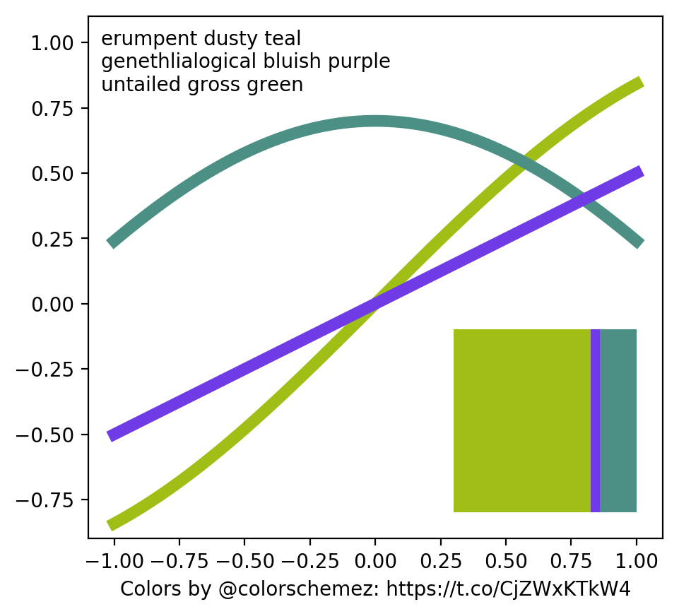

# ScientificColorschemez

I cannot be alone in marvelling in the fantastic colorschemes invented by [@colorschemez](https://twitter.com/colorschemez) hourly! Colors with such tantilising names such as *genethlialogical bluish purple* and *fond saffron*.

Of course, I have a burning need to use these in my day-to-day production of scientific figures. But staying updated with the fashion of the hour is simply too much work!

Enter ScientificColorschemez! This code downloads the latest innovation from [@colorschemez](https://twitter.com/colorschemez) and extracts the colors, ready to be used in your next plot!

## Example

To produce a simple example plot using the latest colorscheme we can write a small program:

```python
from ScientificColorschemez import Colorschemez
import matplotlib.pyplot as plt

cs = Colorschemez.latest()

for name, hexcode in zip(cs.colornames, cs.colors):
    print('%s: %s' % (hexcode, name))

fig, ax = plt.subplots()
cs.example_plot(ax)
fig.savefig('latest.png', dpi=200 bbox_inches='tight')
```

which, at the time of writing, produces the text

```
#9fbf16: erumpent dusty teal
#4c9085: genethlialogical bluish purple
#703ae6: untailed gross green
```

and the figure




## Installation

I've have not bothered packaging the code due to lazyness (pull requests welcome!), so for now just download the code, the dependencies are: 
[tweepy](www.tweepy.org/), [scikit-learn](http://scikit-learn.org/), [matplotlib](https://matplotlib.org/), [scipy](https://www.scipy.org/), [pillow](https://python-pillow.org/), and [requests](http://docs.python-requests.org/en/master/).
A Pipfile and a requirements.txt is included so you can easily install these dependencies.

To use the code you need to reqister an Twitter app and give it access to your account. You need to generate various OAuth tokens and secrets and populate them in a config.py. To help you with that you can run the included program generate_config.py.